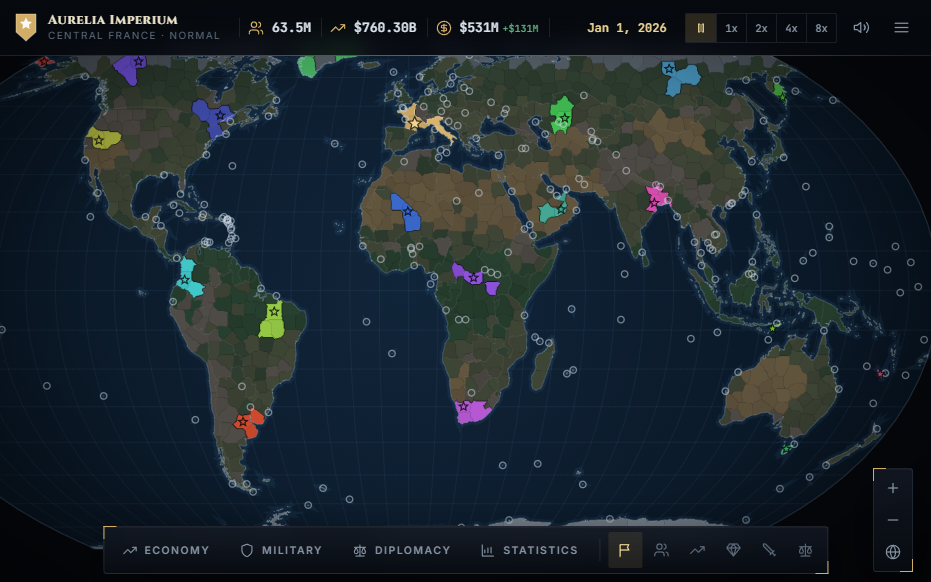
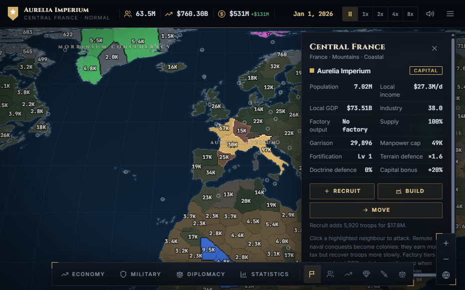
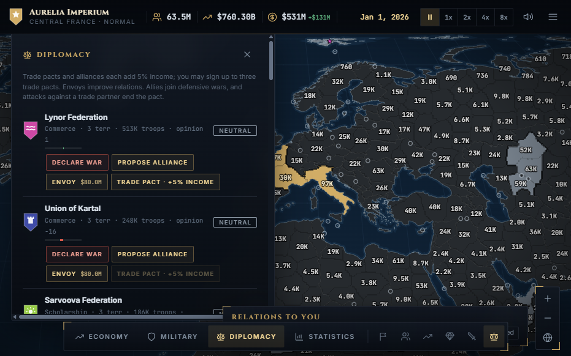
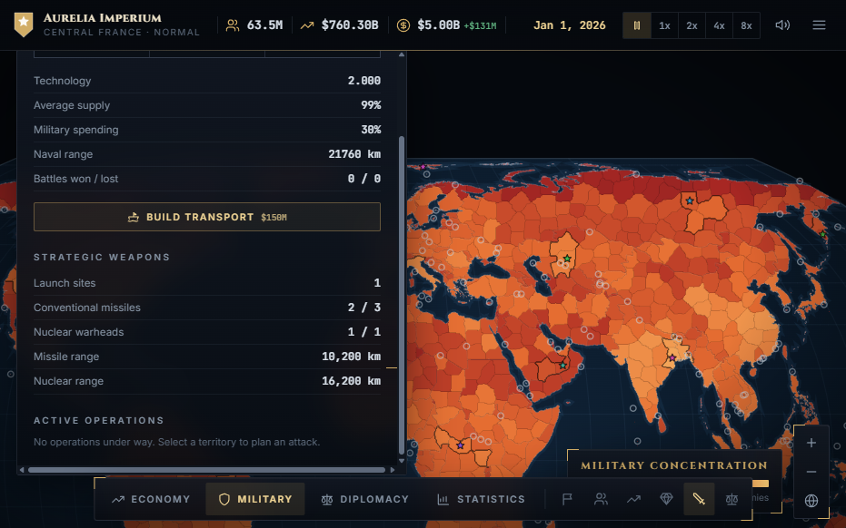

# World Conquest: Empires of Earth

**Build an empire anywhere on Earth.** Expand your borders, develop your economy, forge alliances, and choose how far you are willing to go for victory.

> **[Play World Conquest](https://tanay-tole.github.io/world-conquest-game/)**

## Screenshots

<table>
  <tr>
    <td width="50%">
      <a href="screenshots/campaign-map.png"></a>
      <p align="center"><strong>Campaign map</strong></p>
    </td>
    <td width="50%">
      <a href="screenshots/territory-details.png"></a>
      <p align="center"><strong>Territory details</strong></p>
    </td>
  </tr>
  <tr>
    <td width="50%">
      <a href="screenshots/diplomacy.png"></a>
      <p align="center"><strong>Diplomacy</strong></p>
    </td>
    <td width="50%">
      <a href="screenshots/strategic-arsenal.png"></a>
      <p align="center"><strong>Strategic arsenal</strong></p>
    </td>
  </tr>
</table>

## Lead your nation

- Choose a homeland and expand across a detailed, interactive world map.
- Balance your economy, population, supplies, research, and military spending.
- Upgrade territories with factories, fortifications, and other developments.
- Establish overseas colonies and manage their policies.
- Negotiate diplomacy, alliances, and trade pacts—or prepare for war.
- Plan land campaigns and naval invasions.
- Research missile technology, build launch sites, and consider the risks of conventional and nuclear weapons.
- Play at your own pace with adjustable simulation speed and campaign saves.

## How to play

Start a new campaign and select a territory to found your nation. Select territories on the map to inspect them and use the Economy, Military, and Diplomacy panels to manage your strategy. Pause or adjust the simulation speed from the top bar. The in-game **How to Play** guide explains the available actions and systems.

The game is designed to adapt to desktop, tablet, and phone screens. Your campaign is saved in your browser; saves are local to that browser and are not shared between devices.

## Run locally

This is a static web game with no build step. Serve the repository over HTTP rather than opening `index.html` directly, since the game loads map data asynchronously.

For example, with Python installed:

```bash
python -m http.server 8000
```

Then open [http://localhost:8000](http://localhost:8000). Map boundaries and interface fonts are loaded from public CDNs, so an internet connection is needed.

## Deployment

The [GitHub Actions workflow](.github/workflows/deploy-pages.yml) publishes the game to GitHub Pages whenever changes are pushed to `main`. The playable site is [tanay-tole.github.io/world-conquest-game](https://tanay-tole.github.io/world-conquest-game/).

## Credits

Country boundaries are based on Natural Earth data distributed through [world-atlas](https://github.com/topojson/world-atlas). The game uses [D3.js](https://d3js.org/) and [TopoJSON](https://github.com/topojson/topojson).
